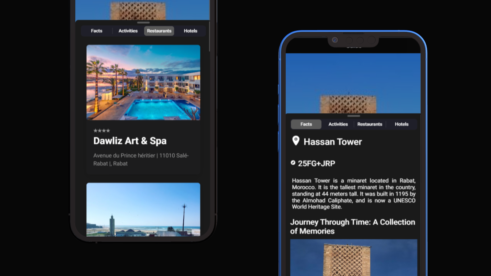
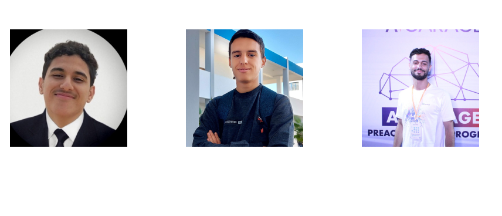
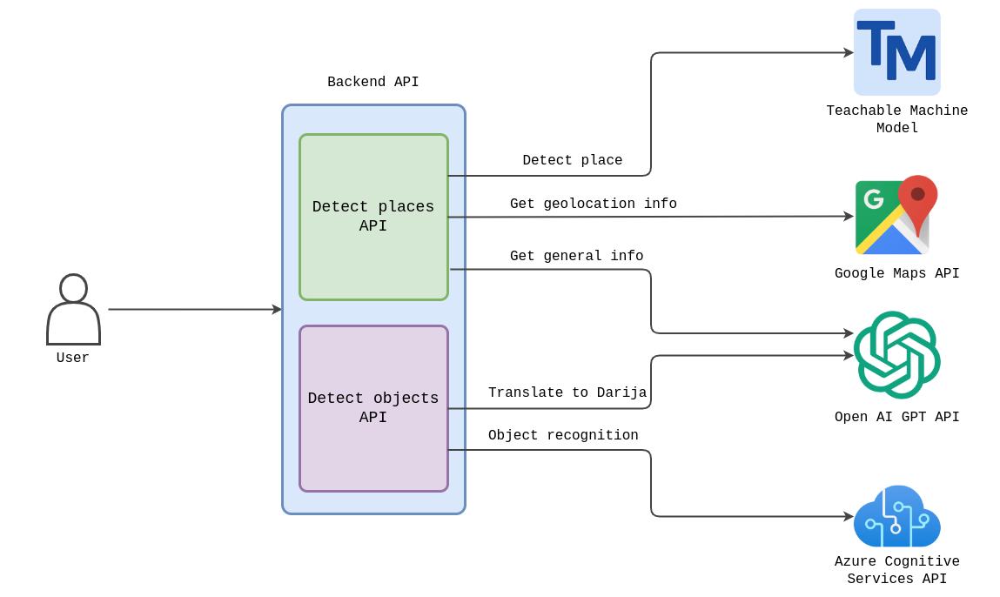
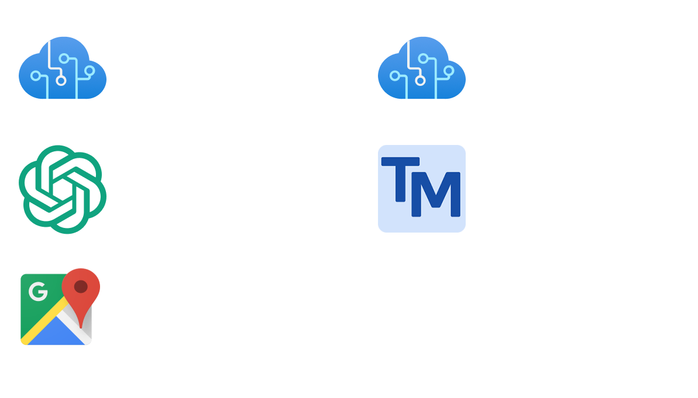

# Moroccam

Experience Morocco like a local with Moroccam, the ultimate travel companion app for capturing the essence of Morocco through its language and culture.

 

## Table of Contents

- [About the Project](#about-the-project)
- [Our Team](#our-team)
- [The Architecture](#the-architecture)
  - [General Overview](#general-overview)
  - [Used APIs](#used-apis)
  - [Used Technologies](#used-technologies)
- [How to Use](#how-to-use)
  - [Usage](#usage)
  - [Screenshots](#screenshots)
  - [Limitations](#limitations)
- [Roadmap](#roadmap)
- [Contact](#contact)

## About the Project

Moroccam is a mobile application that aims to enhance the travel experience for tourists visiting Morocco.

With Moroccam, tourists can take pictures of objects and landmarks and get instant translations and information in Moroccan darija, the local dialect.

Moroccam is designed with a simple and user-friendly interface, making it easy for tourists to navigate and use the app.

## Our Team

We are a passionate team with diverse backgrounds and a shared goal of making a positive impact through innovative technology. As participants in a hackathon, we are excited to bring our skills together to create Moroccam.

## The Architecture

### General Overview

The Moroccam app architecture is designed to efficiently handle the different functionalities of the app. The backend of the app consists of two endpoints. 

- The first endpoint is responsible for detecting the location of the image provided by the user using Teachable Machine models trained on images of different locations in Morocco, along with the Google Maps API and OpenAI API.
- The second endpoint is used for object detection using Azure Cognitive Services and OpenAI API. 

This design allows for faster and more accurate processing of user requests, resulting in an enhanced user experience.

### Used APIs

We utilized Azure Cognitive Services API to enhance the user experience by incorporating features like object detection and text-to-speech. Object detection allowed us to identify objects present in an image taken by the user, while text-to-speech was used to convert the object's name into an audio file that could be played back to the user.

We used OpenAI's powerful GPT-3 language model to retrieve relevant information about places, such as historical significance and popular attractions, and present it to the user in their preferred language, as we integrated translation service from English to Moroccan Darija.

We integrated the Google Maps API to retrieve place information, images, and nearby restaurants and hotels. This APIs offered a wide range of features to make the user's experience more enjoyable.

Finally, we used Teachable Machine by Google to train our model to recognize images of various places in Morocco. By using machine learning algorithms, we were able to detect places from images captured by the user and retrieve relevant information about them.

### Used Technologies

- [![Node.js][Node.js]][Node.js-url]
- [![Express][Express.js]][Express-url]
- [![Ionic][Ionic.js]][Ionic-url]
- [![Angular][Angular.js]][Angular-url]
- [![TypeScript][TypeScript]][TypeScript-url]
- [![Python][Python]][Python-url]
- [![TensorFlow][TensorFlow]][TensorFlow-url]

## How to Use

### Usage

Moroccam is a useful mobile application for anyone traveling to Morocco who wants to learn more about the country's culture and landmarks. It will helps you to communicate with locals, learn the language, and experience the local culture. Additionally, Moroccam provides you with information about monuments, landmarks, restaurants, and activities near your location, making it easy to discover the best of Morocco.

Finally, anticipate any common issues or questions that users may have, and provide solutions or answers to them. This could include issues related to camera or location permissions, or errors in scanning objects. For example:

- If the app is not recognizing an object, make sure you have good lighting and are holding the camera steady.
- If the app is not getting your location correctly, make sure your device's GPS is turned on and you have a good internet connection.
- If you encounter any other issues or have questions, please contact our team .

### Screenshots

### Limitations

Moroccam is intended to assist tourists, but there are a few limitations to consider. Object recognition and translation accuracy may be affected by lighting and other environmental factors, and there may be limited information available for some locations. Here are some of the limitations:

- Moroccam currently does not recognize all traditional Moroccan objects. Therefore, tourists may not be able to scan and identify certain objects in Darija or English.

- While the app provides the name of an object in Darija, it does not include the pronunciation of the word. This may make it challenging for tourists to say the word correctly, especially if they are not familiar with the Darija language.

- The app's Darija translation is based on a pre-trained machine learning model, and may not be 100% accurate. However, we are constantly working to improve our model and provide the best possible translation for our users.

## Roadmap

- [x] Basic functionality

  - [x] Object detection
  - [x] Text-to-speech
  - [x] Places recognition

- [x] API integration

  - [x] Use the Teachable Machine trained model.
  - [x] Integrate the Azure Cognitive Services.
  - [x] Integrate the OpenAI API.
  - [x] Integrate the Google Maps API.

- [x] User interface

- [ ] Enhancements
  - [ ] Save to favorite.
  - [ ] Optimize translation.
  - [ ] Add more languages.
  - [ ] Add more places.

## Contact

**BRAHIM EL HOUBE :**

<a href="https://www.linkedin.com/in/elhoube-brahim/">![LinkedIn][linkedin-shield]</a>
<a href="https://github.com/ElhoubeBrahim">![GitHub][github-shield]</a>
<a href="https://brahimelhoube.com">![Website][website-shield]</a>

**EL BACHIR OUTIDRARINE :**

<a href="https://www.linkedin.com/in/el-bachir-outidrarine/">![LinkedIn][linkedin-shield]</a>
<a href="https://github.com/StoicBug/">![GitHub][github-shield]</a>

**YOUSSEF BEN SADIK :**

<a href="https://links.bensadik.net/linkedin">![LinkedIn][linkedin-shield]</a>
<a href="https://links.bensadik.net/github">![GitHub][github-shield]</a>

[Node.js]: https://img.shields.io/badge/node.js-44883e?style=for-the-badge&logo=node.js&logoColor=white
[Node.js-url]: https://nodejs.org/en/
[Express.js]: https://img.shields.io/badge/express.js-000000?style=for-the-badge&logo=express&logoColor=white
[Express-url]: https://expressjs.com/
[Ionic.js]: https://img.shields.io/badge/Ionic-176bff?style=for-the-badge&logo=ionic&logoColor=white
[Ionic-url]: https://ionicframework.com/
[Angular.js]: https://img.shields.io/badge/angular.js-b52e31?style=for-the-badge&logo=angular&logoColor=white
[Angular-url]: https://angular.io/
[Python]: https://img.shields.io/badge/python-f7cd39?style=for-the-badge&logo=python&logoColor=white
[Python-url]: https://www.python.org/
[TensorFlow]: https://img.shields.io/badge/tensorflow-f77509?style=for-the-badge&logo=tensorflow&logoColor=white
[TensorFlow-url]: https://www.tensorflow.org/
[TypeScript]: https://img.shields.io/badge/typescript-2f74c0?style=for-the-badge&logo=typescript&logoColor=white
[TypeScript-url]: https://www.typescriptlang.org/
[linkedin-shield]: https://img.shields.io/badge/-LinkedIn-0A66C2?style=for-the-badge&logo=linkedin&logoColor=white
[github-shield]: https://img.shields.io/badge/-GitHub-181717?style=for-the-badge&logo=github&logoColor=white
[website-shield]: https://img.shields.io/badge/-Website-4285F4?style=for-the-badge&logo=google-chrome&logoColor=white
[gmail-shield]: https://img.shields.io/badge/-Gmail-D14836?style=for-the-badge&logo=gmail&logoColor=white
